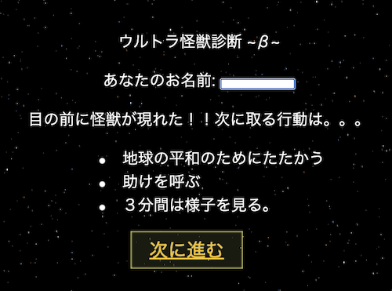

# ウルトラマン-キャラクター診断

### 概要
* 制作期間: 3日間
* 使用技術: HTML,CSS,JavaScript,ローカルストレージ 
* プロダクト紹介映像： https://youtu.be/h1iD7-Uv5oE  

DBを使ったアプリを作る前段として、ローカルストレージを使ったアプリ制作をしました。
クイズ形式で、ユーザーの回答を保持していき、回答によって診断結果が変わります。
アルゴリズムはシンプルで、ユーザーの選んだ選択肢毎に数字を加算していき、最後のページで合計値を算出。合計値によって、診断結果が変わります。
普段、自分が使っているアプリケーションをアルゴリズムに置き換えて実装する、という経験を積むことができました。

### 動作環境
* VsCode推奨。拡張機能でLiveServerをインストール。[LiveServer](https://marketplace.visualstudio.com/items?itemName=ritwickdey.LiveServer)経由でindex.htmlをブラウザで開くとアプリが動作します。
* [index.html](https://github.com/worldwideweb13/Tecmon/blob/106b97e0da5932f9f59b4c0ec6a3f0c7f43e6a79/index.html) のコメントアウトの記述" //Your web app's Firebase configuration" 以下の部分からはご自身のfirebase利用環境の設定を書き込んで下さい。

### 開発の苦労した点
ローカルストレージの値更新とデータ取得処理に苦労しました。
ローカルストレージでは扱える値は、String型のみという仕様だったため、各ページでは以下の手順を踏みました。
1. ローカルストレージから現在のユーザー加算値を取得
2. ユーザー加算値を整数型に変換
3. ユーザー加算値とユーザーが選択した選択肢の値を足し合わせる
4. ３の値をStrging型に変換。
5. 4をローカルストレージ に保持して次のページに遷移

型の概念に気づく事と、型を変換して計算する方法を思いついた頃には、朝日が見えておりました。。
作り切ることができてホッとしております。ε-(´∀｀*)

